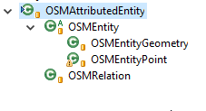
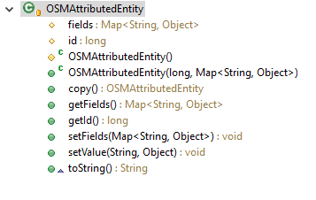
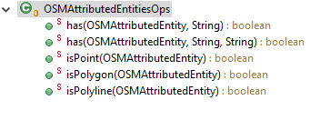
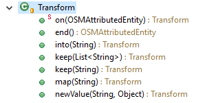

#OSMImport - Scripts DSL reference

##Groovy

Groovy is used to define the script, this permit to inline programmatic transformations and benefit from a concise and compile phase to check the correctness of the definition. 

Third java party can also directly be used from the script, this permit also to use external libraries to integrate custom transformations or operations. In order to use a java library, put it in the classpath, and use it in the script.

When the script is executed , a bunch of properties, functions and objects are predefined :

_predefined objects table :_

<table>
<tr>
<th>
	name
</th>
<th>
	kind of object
</th>
<th>
	Description / use
</th>

</tr>

<tr>
<td><b>osmstream</b></td><td>object</td>
<td>this object is the main osmstream read from the file (further details will come next).
</td>
</tr>

<tr>
<td><b>builder</b></td><td>object</td>
<td>this object is the builder for the transformation graph, it has only one method : build(<i>rootstream</i>). This method take in parameter, the main osm entity stream and call the definition of the graph creation using the following braces. 

<pre>

builder.build(osmstream) {

	// define output stream
	sortie = gdb(path : var_gdb) {
		// transformation graph directives
	}

</pre>

</td>
</tr>

</table>

##output sinks : gdb / csv directive

Thoses 2 directives define the structure of the output (in a geodatabase or in a folder containing CSV files) [CSV output format](CSVOutputFormat.md), **gdb or csv** is defined with a "**path**" attribute locating the destination of the result.

	csv(path:"..." ) { // create a directory containing the output csv files
		....
	}

	or  gdb(path:"...") { // create a file geodatabase containing the output tables and featureclasses

	}

Inside thoses directive, you can place multiple **featureclass** or **table** elements defining the structures to create. 

The **featureclass** directive take 3 parameters :

  - the name of the featureclass (String)
  - the geometry type : ( **ESRI_GEOMETRY_POINT**, **ESRI_GEOMETRY_POLYLINE**, **ESRI_GEOMETRY_POLYGON**)
  - The coordinate system to use (for the moment : **only WGS84**)

**table** directive only take 1 parameter : the name of the table

inside **featureclass** or **table** directive, other directives are placed for defining the fields :

		gdb(path : var_outputgdb) { 
			featureclass("pts", ESRI_GEOMETRY_POINT,"WGS84") {
				_long('id')
			}
			featureclass("lines", ESRI_GEOMETRY_POLYLINE,"WGS84") {
				_long('id')
			}
			featureclass("polygon", ESRI_GEOMETRY_POLYGON,"WGS84") {
				_long('id')
			}
			table("rels") {
				_long('id')
				_long('rid')
				_text('role', size:20)
				_text('type', size:30)
			}	
		}

- **\_text** : define a text field , the first parameter is the field name. Additional named parameters can be defined for :

<table>
			<tr>
			<th>
				Associated Attributes
</th>
<th>Description</th>
</tr>

<tr>
<td>size</td><td>specify the size of the field (by default, 255)</td>			

</tr>	
</table>
       

- **\_integer** : define an integer field.

<table>
			<tr>
			<th>
				Associated Attributes
</th>
<th>Description</th>
</tr>

<tr>
<td><i>none</i></td><td></td>			

</tr>	
</table>

- **\_long** : define long field.

<table>
			<tr>
			<th>
				Associated Attributes
</th>
<th>Description</th>
</tr>

<tr>
<td><i>none</i></td><td></td>			

</tr>	
</table>

- **\_double** : define an double floating point field.

<table>
			<tr>
			<th>
				Associated Attributes
</th>
<th>Description</th>
</tr>

<tr>
<td><i>none</i></td><td></td>			

</tr>	
</table>

Use example :

	// this example below define an output stream, and the output tables and featureclasses
	
	//
	// Create a file geodatabase with 3 featureclasses, using the WGS84 output format
	//
	//   pts : having an id field of integer.
	//   line, polygon : also having an integer id field
	//
	//    a table : "rels", containing 4 fields (id, rid, role, type)
	output = gdb(path : var_outputgdb) { //
		featureclass("pts", ESRI_GEOMETRY_POINT,"WGS84") {
			_long('id')
		}
		featureclass("lines", ESRI_GEOMETRY_POLYLINE,"WGS84") {
			_long('id')
		}
		featureclass("polygon", ESRI_GEOMETRY_POLYGON,"WGS84") {
			_long('id')
		}
		table("rels") {
			_long('id')
			_long('rid')
			_text('role', size:20)
			_text('type', size:30)
		}	
	}

	// this example below define a CSV folder (same definition as above)
	output = csv(path : var_outputcsvfolder) {
		featureclass("pts", ESRI_GEOMETRY_POINT,"WGS84") {
			_long('id')
		}
		featureclass("lines", ESRI_GEOMETRY_POLYLINE,"WGS84") {
			_long('id')
		}
		featureclass("polygon", ESRI_GEOMETRY_POLYGON,"WGS84") {
			_long('id')
		}
		table("rels") {
			_long('id')
			_long('rid')
			_text('role', size:20)
			_text('type', size:30)
		}	
	}

#Transforming entities

Entities may be transformed in streams, entities are passed throught streams and may be adjusted or multiple entities could be returned in the stream to handle relationships.

the transform directive take an initial input parameter that may be of type OSMEntity this class is subclassed for augmented information on it.

all passed entities derived from OSMAttributesEntity, this class handle :

- an ID (osm id)
- a list of key/value pairs

fields are handled in a Hash , having the osm key string. values are object to handle the transforms of the values in the stream chain.

this internal hash may be null to save space in the process.

two subclasses are deriving from this main class :

- OSMEntity, that handle an extra constructed geometry to it
- OSMRelation, that handle relations (and remember the external relations)

OSMEntity has two subclass :

- OSMEntityGeometry, handling a rich ESRI geometry
- OSMEntityPoint, handling a point geometry

##Transform DSL

in transforme or filter directives, your can use the objects methods, depending on the kind of passed entities. but you also have some facilitating classes to handle the testing and transforming elements.

the OSMAttributedEntitiesOps groovy category helps you make some tests on the entities :

this class is automatically imported as a category in the script and used in transform or filter section in the following manner, making it like a small effort to produce new transformations :

		// a firestation stream
		firestations = stream(osmstream, label:"firestation") {
			filter {
				 e -> isPoint(e) && has(e,"amenity","fire_station")
			}
			transform {  e ->
				on(e).map("name").into("name").newValue("id", e.id).end()
			}
	
		}

##Testing operators

<table>
	<tr>
		<th>Operator</th>
		<th>Description</th>
	</tr>
	<tr>
		<td>isPoint</td>
		<td>test whether the geometry is a point geometry</td>
	</tr>
	<tr>
		<td>isPolygon</td>
		<td>test whether the geometry is a polygon geometry</td>
	</tr>
	<tr>
		<td>isPolyline</td>
		<td>test whether the geometry is a polyline geometry</td>
	</tr>
	<tr>
		<td>has(KEY_NAME)</td>
		<td>test whether the entity has a key defined in the attributes</td>
	</tr>
	<tr>
		<td>has(KEY_NAME, VALUE)</td>
		<td>test whether the entity has a key defined in the attributes, and the value of the attribute match the given parameter</td>
	</tr>

</table>

##Transforming DSL

a simple added DSL helps you create new entities from the given ones. This DSL is handled by the Transform.groovy class

###DSL chain grammar

the DSL starts with the on() directive, this directive start the creation of a **NEW** entity, and return the modification context. the new entity is created on the **.end()** directive.

Once the "on" element has been called, you can either use :

	.map(KEY1) : specify you work on the KEY1 attribute of the original entity
	.keep(KEY1) : say you keep the KEY1 key from the original entity
	.keep( [KEY1, KEY2, KEY3 ] ): say you keep a list of keys in the destination entity
	.newValue(KEY, VALUE) : say you add a specific key and value to the output entity

The final creation of the newcurrently building entity is done using the final .end() directive.

###Samples

creating a new entity with only one output field "name_fire", taking the original "name" field, this is a kind of renaming the field in the output.

	on(e).map("name").into("name_fire").end()

creating a new entity with only one output field "name", taken from the original "name" field.

	on(e).keep("name").end()

Chaining the directive is possible :

	on(e).keep("name").map("hydrant").into("hydrant_type").end()

Example of the definition of a full stream using the DSL :

	hydrant = stream(osmstream, label:"hydrant") {
                filter {
                    e -> isPoint(e) && has(e, "emergency", "fire_hydrant")
                }

	            transform { e ->
	                on(e).
	                map("fire_hydrant:type").into("type").
	                map("fire_hydrant:diameter").into("diameter").
	                map("fire_hydrant:pressure").into("pressure").
	                map("fire_hydrant:position").into("position").
	                map("fire_hydrant:count").into("count").
	                newValue("id", e.id). // put the id in an exported attribute named "id"
	                end()
	
	            }
	            
        }