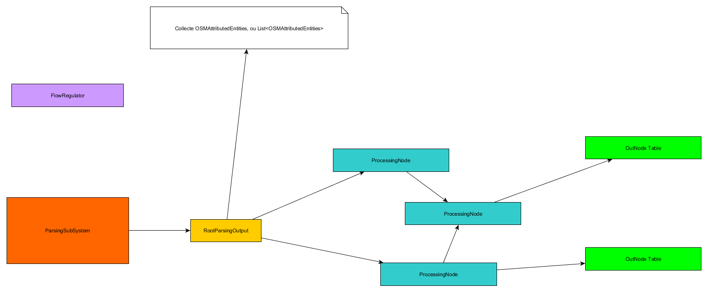

#Architecture

*Patrice Freydiere - Juillet 2015*

##Concepts

The concepts of this project is to have a simple way to read and parse OSM Data for GIS or analytical use (in extracting a sub range of the original datas).

##Architecture

This is a quite standard ETL architecture, using an actor system to do the job.
a first sub system parse the pbf file and send to an output a collection of parsed entities.

The second subsystem is the driven by the groovy DSL that permit to have the construct of the processing part (in terms of flows). 

Once the output is defined for an output, it will be sent to the correct actor to write the destination entity (with the transformed attributes).

As the actor system needs regulation for the message a Flow regulator, referenced in the Parsing Subsystem, regulate the input to limit the memory and message congestion.